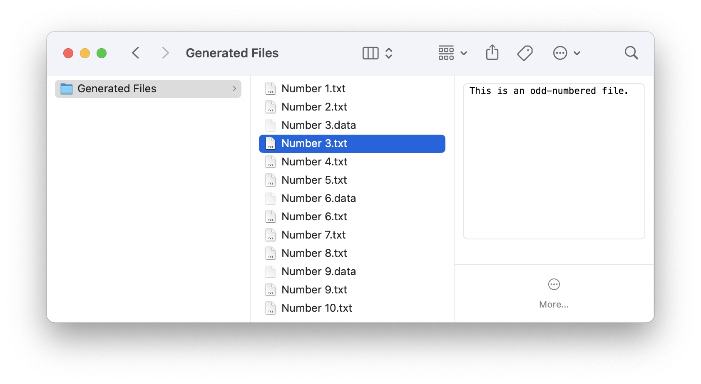

# FileBuilder

This package generates files and directories in a declarative manner, allowing you to think about the contents rather than the “book-keeping” required for representing file hierachies and creating text files.

Two result builders are provided, `FileBuilder` and `TextBuilder`, and using these to build file hierarchies is similar to using SwiftUI for building view hierarchies.

### FileBuilder

`FileBuilder` allows the creation of directories and files. This allows one script to create the correct directory structure and generate multiple files within them.

A file builder takes a list of `File` values to build up. Three primary kinds are provided:
* `Directory`: Defines a directory and its contents.
* `DataFile`: Creates a new file with data.
* `TextFile`: Creates a new text file, with contents generated with a `TextBuilder`.

### TextBuilder

`TextBuilder` is used for building up a string inside of a `TextFile`.

## Example

`FileBuilder` and `TextBuilder` take advantage of all the niceties provided by swift result builders, allowing inline for loops and if statements to build up a directory of files and files of text.

The following code creates a directory named “Generated Files” in a given parent directory. Then a text file is created for each number from 1 to 10 and a data file for numbers 3, 6 and 9. The contents of the text file is determined by whether the number is even or not.

```swift
func generate(in url: URL) throws {

    try Directory("Generated Files") {
        for i in (1...10) {

            TextFile("Number \(i).txt") {
                if i.isMultiple(of: 2) {
                    "This file is even-numbered."
                } else {
                    "This is an odd-numbered file."
                }
            }

            if i.isMultiple(of: 3) {
                DataFile("Number \(i).data", data: Data())
            }
        }
    }
    .write(in: url)
}
```

The following shows Finder with a “Generated Files” directory containing 10 text files and 3 data files.



It is also possible to define `File` implementations to allow logic to be extracted and easier reasoning with large amounts of generation. The following code is equivalent to the code above with the text and data files broken out into their own types.

```swift
struct EvenOddTextFile: File {

    let number: Int

    var body: some File {
        TextFile("Number \(number).txt") {
            if number.isMultiple(of: 2) {
                "This file is even-numbered."
            } else {
                "This is an odd-numbered file."
            }
        }
    }
}

struct MultipleOfThreeDataFile: File {

    let number: Int

    var body: some File {
        if number.isMultiple(of: 3) {
            DataFile("Number \(i).data", data: Data())
        }
    }
}

func generate(in url: URL) throws {

    try Directory("Generated Files") {
        for i in (1...10) {
            EvenOddTextFile(number: i)
            MultipleOfThreeDataFile(number: i)
        }
    }
    .write(in: url)
}
```
